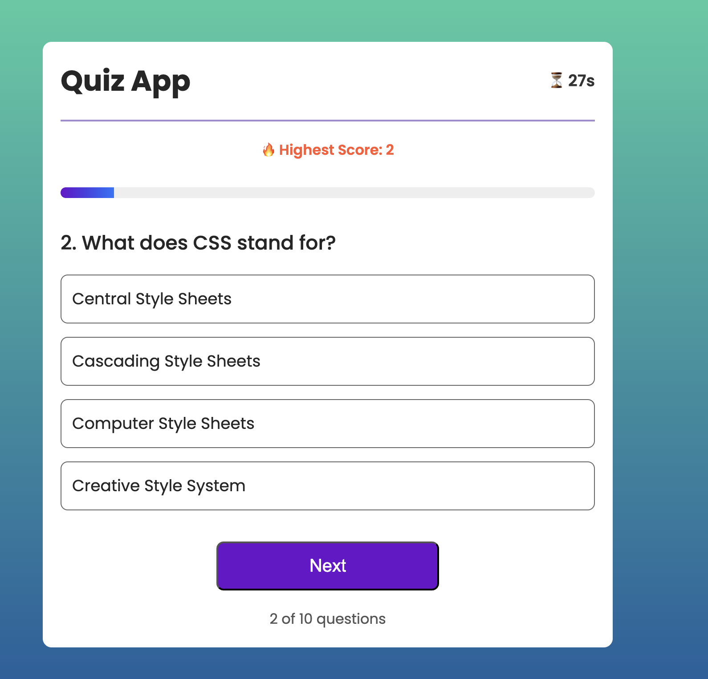
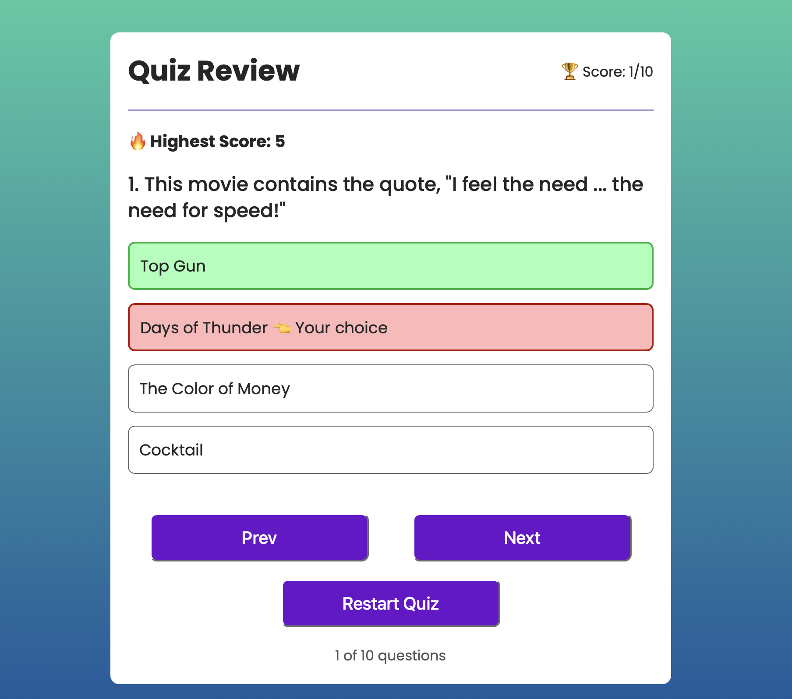
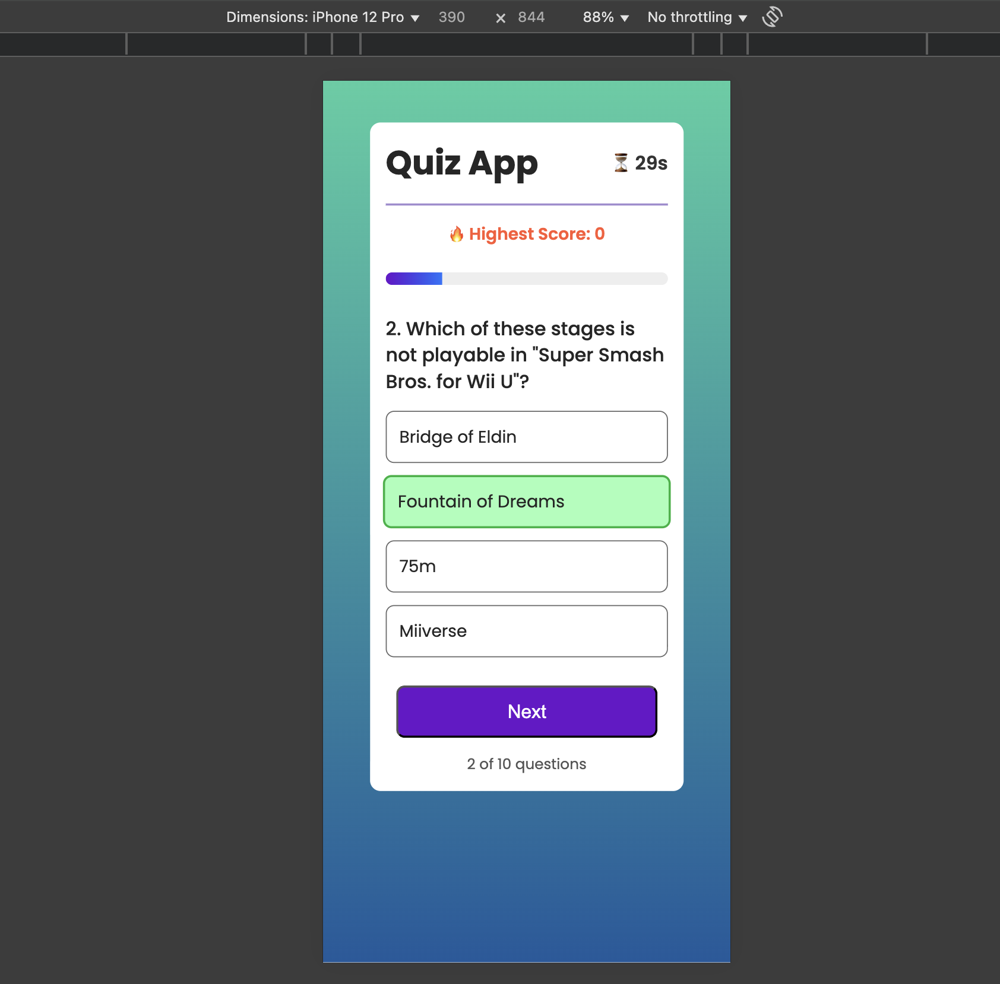
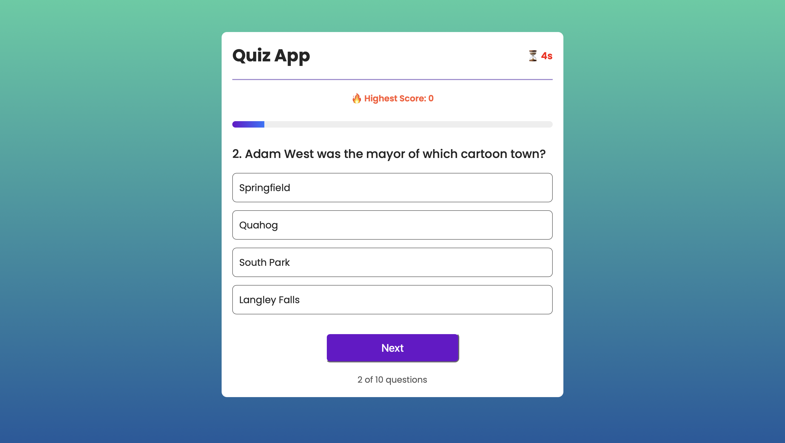
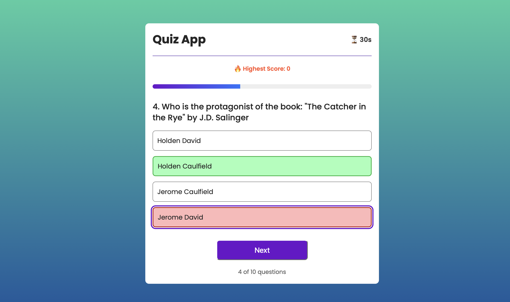
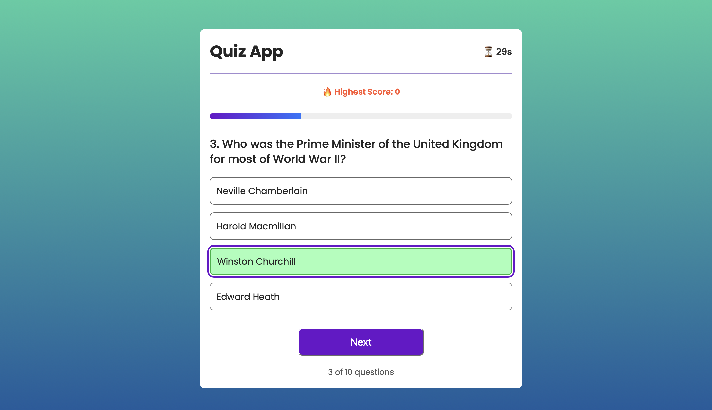

# 📘 Quiz App (React + Vite)

A responsive quiz application built with **React + Vite** featuring live score tracking, a countdown timer ⏳, a progress bar 📊, results review ✅, and persistent high scores 🏆.  

---

## ✨ Features

- 🎯 Multiple-choice quiz (from [Open Trivia DB API](https://opentdb.com/))  
- ⏳ 30s timer per question  
- 📊 Progress bar & question counter  
- ✅ Answer review mode (Prev/Next navigation)  
- 🏆 High score persistence (`localStorage`)  
- 📱 Responsive design  
- ⚠️ Error handling with local JSON fallback  

---

## ✨ Demo Link

👉 [Live Demo](quiz-app-kappa-wheat.vercel.app)


## 📂 Project Structure

```bash
quiz-app/
├── public/                  # Static assets copied to dist/
│   └── _redirects           # Netlify routing rules
├── src/
│   ├── Components/
│   │   └── Quiz/
│   │       ├── Quiz.jsx        # Main quiz flow
│   │       ├── Results.jsx     # Results & review
│   │       ├── ProgressBar.jsx # Progress indicator
│   │       └── HighScore.jsx   # High score display
│   ├── services/
│   │   └── quizService.js      # API fetch + normalization
│   ├── assets/
│   │   └── questions.json      # Local fallback data
│   ├── App.jsx                 # Routes (/quiz, /results)
│   ├── main.jsx                # Entry point
│   └── index.css               # Global styles
├── index.html                  # Root HTML file
├── package.json
├── vite.config.js
└── README.md


```


## 🛠️ Getting Started

### 1. Clone the repository
```bash
git clone https://github.com/<your-username>/quiz-app.git
cd quiz-app

```

### 2. Install dependencies
```bash
npm install
```

### 3. Run the development server
```bash
npm run dev
```


### The app will be available at:
```bash
👉 http://localhost:5173/quiz
```

### 4. Build for production
```bash
npm run build
```


### Preview the production build locally:
```bash
npm run preview

```
## 📸 Screenshots
```bash
**Quiz Page**
```




```bash
**Result View**
```


```bash
**Mobile View**
```




```bash
**Timer View**
```


```bash
**Wrong Answer View**
```



```bash
**Correct Answer View**
```



